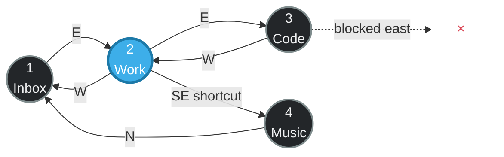

<p align="center">
  
</p>

<h1 align="center">KWin Topos</h1>

<p align="center">
  <strong>Virtual desktops, liberated from the grid.</strong><br>
  A KWin fork that turns your workspace into a graph you can see, shape, and traverse.
</p>

---

Most desktop pagers assume every workspace belongs in a rectangle. Topos keeps
that familiar grid as the default, then adds a graph on top: every virtual
desktop is a vertex and every direction you can travel is an editable edge.

That means **east can lead to any desktop**, a corner can become a shortcut,
an edge can be one-way, and an entire layout can wrap like a cylinder, torus,
or sphere.



## Why topology changes the desktop

| | Feature | What it unlocks |
|---|---|---|
| ◉ | **A real workspace graph** | Connect any desktop to any other desktop instead of accepting row-and-column routing. |
| ↗ | **Eight directional ports** | Route north, north-east, east, south-east, south, south-west, west, and north-west independently. |
| ⇄ | **Directed or two-way edges** | Build deliberate one-way flows, symmetric paths, shortcuts, dead ends, and hubs. |
| ◇ | **Interactive graph editor** | Open Grid View and drag a desktop port onto another desktop. The live bridge preview shows exactly what will be connected. |
| ⟳ | **Orientation transport** | Rotate movement in 45-degree steps or mirror it as an edge is crossed, so traversal can model non-flat spaces. |
| ≋ | **Continuous traversal** | KWin resolves the graph while desktop gestures are in progress, including diagonal routes, blocked feedback, and animated placement. |
| ⌘ | **Topology HUD** | See the graph in Overview with directional arrows, the current desktop, grid or loose-DAG layout, and adjustable spread. |
| ⟲ | **History and profiles** | Undo, redo, revisit history, and save named topologies for different activities. |

### Built-in shapes

Start with a preset and customize from there:

- **Base Grid** — standard KWin behavior, with topology tools ready when you need them.
- **Cylinder X / Cylinder Y** — wrap on one axis and keep boundaries on the other.
- **Torus** — wrap both axes; every edge leads somewhere.
- **Sphere** — wrap horizontally and cross the poles with orientation-aware routing.

The graph is not just decoration. Topos plugs its resolver into KWin's normal
virtual-desktop navigation, screen-edge switching, and interactive gesture
path. The map you edit is the map KWin actually follows.

## Edit it where you use it

Open Plasma's **Grid View** to reveal topology handles on every desktop card.
Drag a handle to another desktop to create a route:

- drop in the inner target to create a two-way connection;
- drop in the outer target to create a one-way connection;
- double-click a connection to remove that route, or drag it again to replace it;
- use the HUD to inspect the whole graph, switch layouts, and load or save a preset.

The ordinary Plasma desktop remains ordinary until you open the topology
tools. Existing grid relationships are inherited, so a fresh install starts
from familiar KWin behavior rather than an empty graph.

## Script the graph

`toposctl` exposes the same model for terminal workflows and automation:

```bash
# Inspect the active topology
toposctl status
toposctl edge list

# Try a built-in topology
toposctl preset list
toposctl preset apply Torus

# Make Focus → Build the eastward route, and create the inverse edge too
toposctl --bidirectional edge set Focus E Build

# Turn the north-east edge of Focus into a boundary
toposctl edge block Focus NE

# Save the result and undo the latest edit if needed
toposctl config save "Deep Work"
toposctl undo
```

Desktop selectors can use a desktop name, ID, or index. The public
`org.kde.KWin.Topos` D-Bus interface also exposes graph state, profiles,
history, edits, and runtime settings for other tools.

## Build and try it

> [!WARNING]
> This is an experimental KWin fork, not a standalone compositor. Replacing
> the compositor can interrupt your graphical session, so save your work and
> keep a recovery path available.

This branch currently targets the Plasma 6.7 KWin codebase. The included
[build guide](BUILD.md) covers the Arch package workflow, installation,
reloading KWin, and restoring the distribution package. The repository helper
can perform that documented package build after the package tree is prepared:

```bash
./install-topos-kwin.sh
```

For normal KWin development, see KDE's [contributing guide](CONTRIBUTING.md).

## Under the hood

The implementation is intentionally part of KWin rather than a pager-only
simulation:

- `ToposManager` resolves graph edges and owns traversal, profiles, and history.
- the Overview effect provides the visual editor, bridge preview, and graph HUD;
- virtual-desktop and screen-edge navigation consult the topology resolver;
- `.topos` profiles are watched and loaded at runtime;
- `toposctl` talks to KWin through a versioned D-Bus API.

The result is a small change in vocabulary with a large change in possibility:
**workspaces are places, directions are choices, and the path between them is
yours to design.**

## About KWin

[KWin](https://invent.kde.org/plasma/kwin) is KDE Plasma's flexible Wayland
compositor and window manager. This project is a downstream experimental fork;
the Topos additions are not part of upstream KWin. For issues specific to this
fork, use this repository rather than KDE's bug tracker.

KWin and this fork are distributed under the licenses listed in
[`LICENSES/`](LICENSES/).
