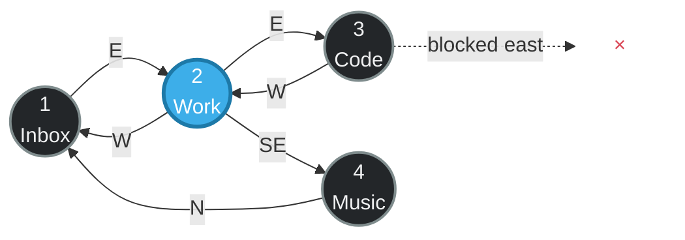
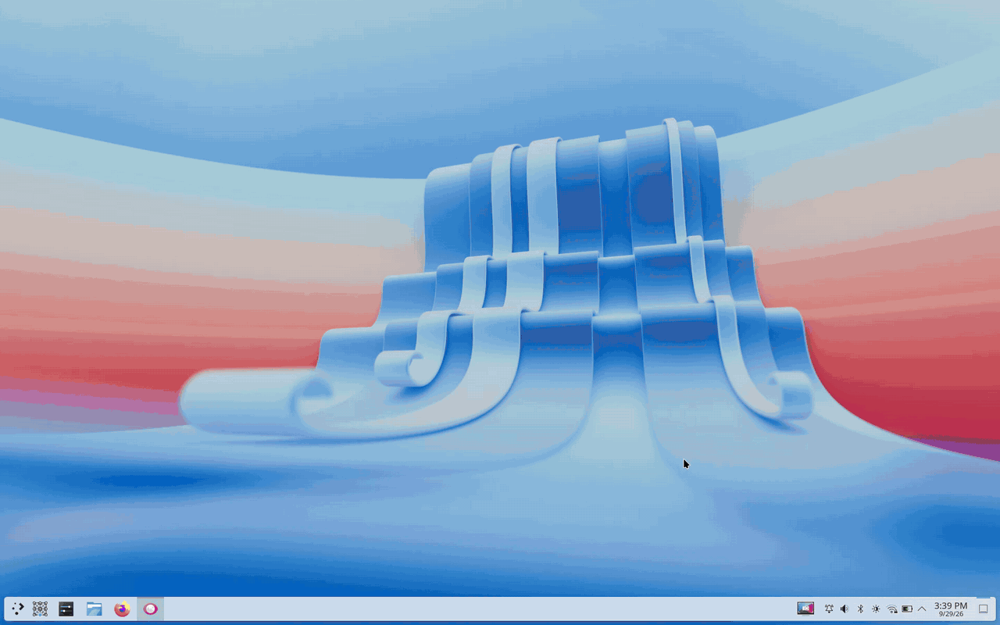
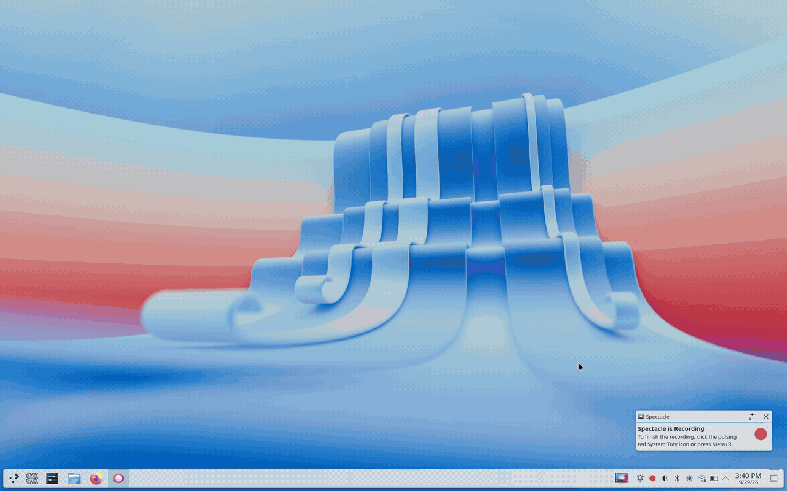
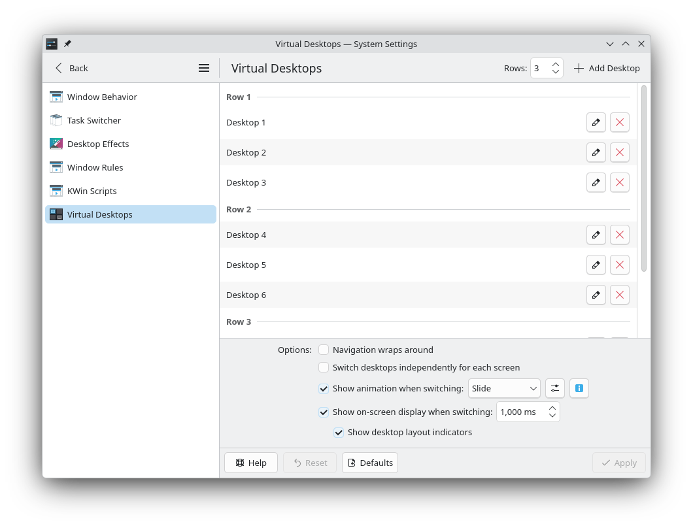
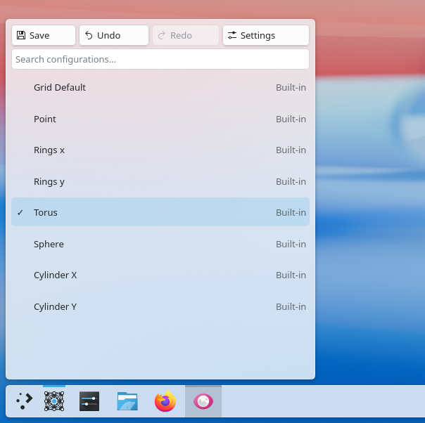

<p align="center">
  
</p>

<h1 align="center">KWin Topos</h1>

<p align="center">
  A KWin fork that adds graph-based virtual desktop navigation.
</p>

Topos keeps KWin's standard desktop grid as the default and adds an editable
navigation graph. Each virtual desktop is a vertex, and each navigation
direction can be connected to another desktop independently.

Connections can be one-way or two-way. A direction can also be blocked.
Layouts can use ordinary grid routing or presets such as cylinders, a torus,
or a sphere.


</div>

## Features

| Feature | Description |
|---|---|
| **Workspace graph** | Connect any desktop to any other desktop instead of relying only on row and column routing. |
| **Eight directional ports** | Configure north, north-east, east, south-east, south, south-west, west, and north-west independently. |
| **Directed and two-way edges** | Create one-way routes, symmetric routes, shortcuts, blocked directions, and hub layouts. |
| **Graph editor** | In Grid View, drag a desktop port onto another desktop to create or replace a connection. |
| **Orientation transport** | Rotate movement in 45-degree steps or mirror it when crossing an edge. |
| **Touchpad traversal** | Touchpad desktop-switch gestures resolve the active graph while the gesture is in progress, including diagonal routes and blocked-edge feedback. |
| **Topology display** | Grid View can show the graph with directional arrows, the current desktop, grid or loose-DAG layout, and adjustable spread. |
| **History and profiles** | The Topos model and D-Bus API provide undo, redo, history navigation, built-in presets, and named user profiles. |

## Showcase

### Default KWin interaction

Without a custom topology, virtual desktops behave like KWin's normal desktop grid.
Desktop switching follows the grid layout and the existing KWin interaction model.
Topos keeps this as the Base Grid preset.



### Graph editor

Grid View exposes eight directional ports on each desktop. Drag a port onto
another desktop to create or replace a route. Connections can be one-way or
two-way, and individual directions can be left blocked.



### Settings

The existing desktop-switch OSD can be enabled from the Virtual Desktops
settings. When Topos is available, this fork uses the topology graph as the
layout indicator in that OSD.



### Desktop switching

Desktop navigation follows the active topology. The desktop-change OSD can
show the graph and mark the current desktop while switching. Touchpad
desktop-switch gestures also resolve routes through the active topology.


### D-Bus profile selection

Topos exposes built-in and user profiles, graph state, undo, and redo through
<code>org.kde.KWin.Topos</code>. The controller shown below is an example client
of that API and is not part of this KWin source tree.



### Torus topology

The Torus preset wraps both grid axes. Wrapped diagonal routes are generated
when the corresponding grid neighbor exists.


### Built-in shapes

The following presets are included:

- **Base Grid**: uses KWin's normal grid routing. Diagonal ports use diagonal grid neighbors when present.
- **Point**: blocks all eight ports on every desktop, leaving isolated desktops that can be connected manually.
- **Rings x / Rings y**: keeps one axis and wraps it into horizontal or vertical rings.
- **Cylinder X / Cylinder Y**: wraps one axis while retaining the other axis's grid boundaries.
- **Torus**: wraps both axes, including wrapped diagonal neighbors where the grid contains them.
- **Sphere**: wraps horizontally and routes across the north and south poles with a 180-degree orientation transport.

Topos is used by KWin's virtual desktop navigation, screen-edge switching, and
touchpad desktop-switch gesture path. The graph edited in Grid View is the graph
used for those navigation paths.

## Set it up

> [!WARNING]
> This is an experimental KWin fork, not an add-on. Installing it replaces
> the KWin package used by your Plasma session. Save your work and keep a
> recovery path available.

This branch targets the Plasma 6.7 KWin codebase. Installation instructions are
in the [build and recovery guide](BUILD.md). The guide currently documents the
Arch Linux package workflow.

After installation:

1. Log out of Plasma and back in so the forked KWin is running.
2. Create at least two virtual desktops on the **Virtual Desktops** page in
   System Settings.
3. Press <kbd>Meta</kbd>+<kbd>G</kbd>, the default shortcut, to open **Grid
   View**. Each desktop card has eight topology handles. The topology map and
   preset controls appear in the HUD.
4. Choose a built-in preset, or drag a handle onto another desktop to create a
   custom route.

On a fresh configuration, Topos starts with **Base Grid**. Later starts restore
the last selected compatible built-in or user profile. In Base Grid, cardinal
movement follows KWin's desktop grid, and diagonal ports resolve to diagonal
grid neighbors when present.

To edit a route:

- drop in the inner target to create a two-way connection;
- drop in the outer target to create a one-way connection;
- double-click a connection to remove that route, or drag it again to replace it;
- use the HUD to inspect the graph, switch layouts, load a preset, or save a named user profile.

Run `toposctl status` to check that the Topos D-Bus interface is available and
to inspect the active topology.

## Command line interface

`toposctl` exposes the same model for terminal use and automation:

```bash
# Inspect the active topology
toposctl status
toposctl edge list

# Apply a built-in topology
toposctl preset list
toposctl preset apply Torus

# Make Focus -> Build the eastward route and create the inverse edge too
toposctl --bidirectional edge set Focus E Build

# Turn the north-east edge of Focus into a boundary
toposctl edge block Focus NE

# Save the result and undo the latest edit if needed
toposctl config save "Deep Work"
toposctl undo
```

Desktop selectors can use a desktop name, ID, or index. The public
`org.kde.KWin.Topos` D-Bus interface also exposes graph state, profiles,
history, edits, and runtime settings for other tools.

## Implementation

Topos is implemented inside KWin rather than as a separate pager:

- `ToposManager` resolves graph edges and owns traversal, profiles, and history;
- the Overview effect provides the graph editor, connection preview, and graph HUD;
- virtual desktop and screen-edge navigation consult the topology resolver;
- the `.topos` profile directory is watched and rescanned at runtime, and profiles are applied when selected;
- `toposctl` communicates with KWin through a versioned D-Bus API.

## About KWin

[KWin](https://invent.kde.org/plasma/kwin) is KDE Plasma's Wayland compositor
and window manager. This project is a downstream experimental fork. The Topos
changes are not part of upstream KWin. Use this repository for issues specific
to the fork rather than KDE's bug tracker.

KWin and this fork are distributed under the licenses listed in
[`LICENSES/`](LICENSES/).
